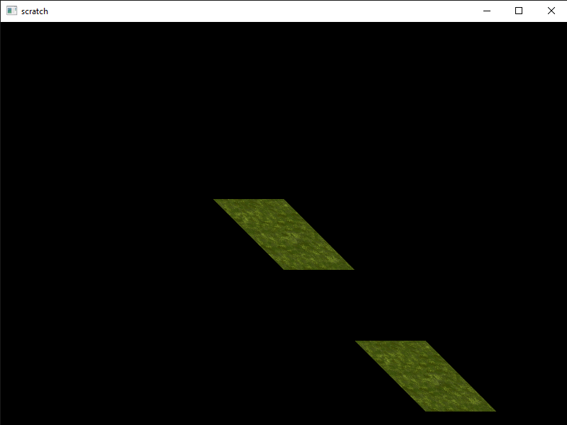

This tutorial will explain how to use 2D textures taking from where we left in the [previous tutorial](/opengl-thing/). Our goal will be creating a texture class that is also implemented in the Thing class we previously created.

Like every other OpenGL object,  a texture is represented by an unsigned int ID. It is then bound using that. Every setting and render operation concerning the type of our texture (for the scope of this tutorial GL_TEXTURE_2D) affects or uses our texture.

Our class will be a small one that looks like this:

```cpp
class Texture{

	unsigned int ID;

public:

	Texture(const char* path);
	void bind();
	~Texture();
};
```

Let's start filling it starting with creating an OpenGL 2D texture object and loading an image. To load image files, we will use the public domain single header library stb_image. It can be downloaded [here](https://github.com/nothings/stb/blob/master/stb_image.h).

After creating and binding our texture we set wrapping and filtering methods. All of these operations, including image setting, will only affect the texture currently bound.

```cpp
void Texture::Texture(const char* path){

	glGenTextures(1, &ID);
	glBindTexture(GL_TEXTURE_2D, ID);
	glTexParameteri(GL_TEXTURE_2D, GL_TEXTURE_WRAP_S, GL_REPEAT);
	glTexParameteri(GL_TEXTURE_2D, GL_TEXTURE_WRAP_T, GL_REPEAT);
	glTexParameteri(GL_TEXTURE_2D, GL_TEXTURE_MIN_FILTER, GL_LINEAR);
	glTexParameteri(GL_TEXTURE_2D, GL_TEXTURE_MAG_FILTER, GL_LINEAR);
}
```

Then we load the file and pass it to OpenGL specifying whether it has an alpha channel depending on the channel count stb_image gives us.

```cpp
void Texture::Texture(const char* path){
	//...
	int width, height, channelCount;
	stbi_set_flip_vertically_on_load(true); //we need this because the positive y direction of most image formats are the opposite of of OpenGL 
	unsigned char* data = stbi_load(path, &width, &height, &channelCount, 0);
	
	if(data){
	
		if(channelCount == 3) glTexImage2D(GL_TEXTURE_2D, 0, GL_RGB, width, height, 0, GL_RGB, GL_UNSIGNED_BYTE, data);
		else if(channelCount == 4) glTexImage2D(GL_TEXTURE_2D, 0, GL_RGBA, width, height, 0, GL_RGBA, GL_UNSIGNED_BYTE, data);
		glGenerateMipmap(GL_TEXTURE_2D);
	}
	else std::cout << "Failed to load texture." << std::endl;
}
```

We can unbind the texture and free the image data now that it has been passed to OpenGL.

```cpp
void Texture::Texture(const char* path){
	//...
	glBindTexture(GL_TEXTURE_2D, 0);
	stbi_image_free(data);
}
```

The bind method will only call the OpenGL bind function.

```cpp
void Texture::bind(){

	glBindTexture(GL_TEXTURE_2D, ID);
}

Texture::~Texture(){

	glDeleteTextures(1, &ID);
}
```

## Implementing to Thing class


It would be nice to have the thing objects bind their textures before they are displayed, for a lot of times a Thing will always be drawn with a specific texture bound.

Let's introduce our class two new members: a Texture pointer to fill when there is a texture attached, and a boolean to keep track of this.


```cpp
class Thing{
	//...
	bool textureSet = false;
	Texture* texture;
};
```

We will also create a function that takes an image file path as a parameter, creates a Texture object and updates the boolean.

```cpp
void Thing::setTexture(const char* path){

	texture = new Texture;
	texture->load(path);
	textureSet = true;
}
```

Lastly, updating the display function to bind the texture if there is one set.

```cpp
void Thing::display(){
	
	if(textureSet) texture->bind();
	//...
}
```

Let's use what we've created here and give our parallelograms [a texture](/grass.png).

```cpp
Thing parallelogram(vertices, sizeof(vertices), indices, sizeof(indices));
parallelogram.setTexture("grass.png");
parallelogram.instance(positions, sizeof(positions));
parallelogram.display();
```


