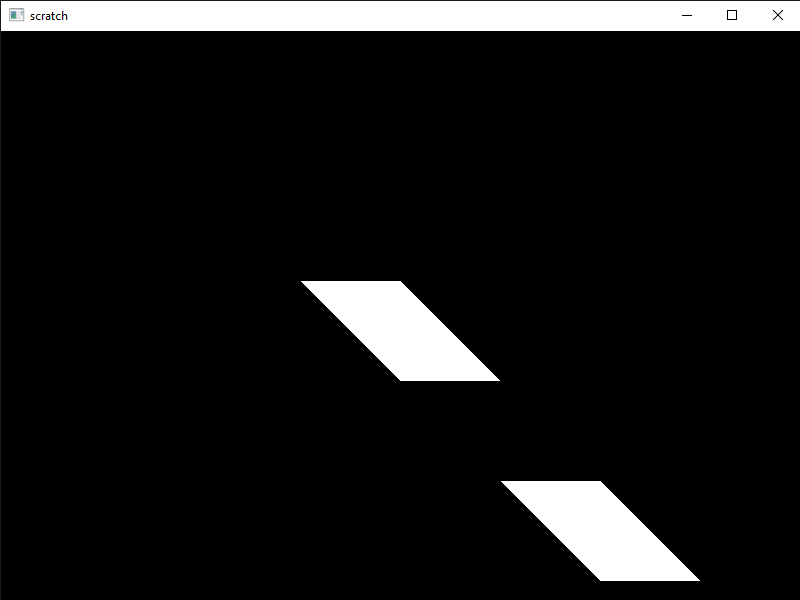

Object oriented programming is one of the greatest gifts god gave to us humans. Using OpenGL, the big state machine, it is inevitable to miss it. So, in this article I am going to explain how I wrapped essential OpenGL "objects" in actual C++ classes, at times grouping some together. Let's go over the process of rendering something and pack them into classes on our way.

We first create and bind a Vertex Array Object to bind the OpenGL "objects" to come (vbo and ebo). Its purpose is to keep track of the properties of a specific thing to be drawn and bind them when bound itself.

```cpp
unsigned int vao;
glGenVertexArrays(1, &vao);
glBindVertexArray(vao);
```

Then, we create and fill a Vertex Buffer Object and an Element Buffer Object. First of which will contain vertex coordinates along with texture image coordinates corresponding to each vertex if we need them (each piece of information called attributes) and the second will contain in which order those vertices are to be drawn, generally called indices (we need this because it is often needed for a vertex to be drawn multiple times as shapes consist of primitives, generally triangles, that often share vertices). These  information will be in arrays and will look like these for a square (consisting of two triangles):

```cpp
float vertices[] = {
	//x,   y, z, s, t
	-50, -50, 0, 0, 1,
	-50,  50, 0, 0, 0, 
	 50,  50, 0, 1, 0,
	 50, -50, 0, 1, 1
};

unsigned int indices[] = {

	0, 1, 3,
	3, 1, 2
};
```

Each vertex here has two attributes: position (x, y, z) and texture coordinates (s, t). Now, on with passing the information and telling how to read it to OpenGL.

```cpp
unsigned int vbo, ebo; //generating our buffers
glGenBuffers(1, &vbo);
glGenBuffers(1, &ebo);

glBindBuffer(GL_ARRAY_BUFFER, vbo); //binding and filling them
glBufferData(GL_ARRAY_BUFFER, sizeof(vertices), vertices, GL_STATIC_DRAW);

glBindBuffer(GL_ELEMENT_ARRAY_BUFFER, ebo);
glBufferData(GL_ELEMENT_ARRAY_BUFFER, sizeof(indices), indices, GL_STATIC_DRAW);

//"explaining" what attributes we pass:
glVertexAttribPointer(0, 3, GL_FLOAT, GL_FALSE, 5 * sizeof(float), (void*)0); //we have position coordinates (3 floats)
glEnableVertexAttribArray(0);

glVertexAttribPointer(1, 2, GL_FLOAT, GL_FALSE, 5 * sizeof(float), (void*)(3 * sizeof(float))); //and texture coordinates (2 floats)
glEnableVertexAttribArray(1);
```

The function glVertexAttribPointer may look complicated but all it does is ask for instructions how to read each vertex data we just passed to OpenGL and  all it takes is nothing more than information we already know:

    glVertexAttribPointer(
		which attribute we are specifying (location), 
		how many elements it has,
		what type those elements are
		whether our data should be normalized to unit range,
		size of all attributes combined for a single vertex,
		position offset for the current attribute
    );

All of the prior information we set are now linked to the vao we created and all that is needed to be done to bind them is binding the vao. It only makes sense to create a class for vao. Let's call it Thing.

```cpp
class Thing{
	
	unsigned int vao, elementCount;
	
public:
	
	Thing(float vertices[], unsigned int vertexCount; unsigned int indices[], unsigned int indexCount);
	void display();
};
```

```cpp
Thing::Thing(float vertices[], unsigned int vertexCount; unsigned int indices[], unsigned int indexCount)\{

	elementCount = indexCount;
	//...
	glBufferData(GL_ARRAY_BUFFER, vertexCount * sizeof(float), &vertices[0], GL_STATIC_DRAW);
	//...
	glBufferData(GL_ELEMENT_ARRAY_BUFFER, indexCount * sizeof(unsigned int), &indices[0], GL_STATIC_DRAW);
}

void Thing::display()\{

	glBindVertexArray(vao);
	glDrawElements(GL_TRIANGLES, elementCount, GL_UNSIGNED_INT, 0);
}
```

## Shaders

For this -or anything in modern OpenGL- to work we need to write at least a fragment and a vertex shader. Let's write simple shaders suitable for the vao class we just created.

```cpp
#version 330 core
//the attributes we defined:
layout (location = 0) in vec3 position;
layout (location = 1) in vec2 textureCoordinates;
out vec2 textureC;
uniform mat4 anyMatrixWeMayHave; //we will discuss this in a later article

void main(){

	gl_Position = anyMatrixWeMayHave * vec4(position, 1.0);
	textureC = textureCoordinates;
}
```

```cpp
#version 330 core
out vec4 FragColor;
in vec2 textureC;
uniform sampler2D textureSampler;

void main(){

	FragColor = texture(textureSampler, textureC);
}
```

## Instancing

Instancing is an essential technique in graphics programming. It allows rendering multiples of an object with a single draw call, reducing the cost of rendering process drastically at times. Let's implement this in our class.

We will need a member variable to keep track of the instances to be rendered, and a function to pass the positions with that adds a third attribute.

```cpp
void Thing::instance(glm::vec3 positions[], unsigned int count){
  
	count = count_;
	if(count != 0){
	
		unsigned int vbo2;
		glGenBuffers(1, &vbo2);
		
		glBindVertexArray(vao);
		glBindBuffer(GL_ARRAY_BUFFER, vbo2);
		glBufferData(GL_ARRAY_BUFFER, count * sizeof(glm::vec3), &positions[0], GL_STATIC_DRAW);
		
		glVertexAttribPointer(2, 3, GL_FLOAT, GL_FALSE, 3 * sizeof(float), (void*)0);
		glEnableVertexAttribArray(2);
		
		glVertexAttribDivisor(2, 1);
	}
}
```

We will also need to update the display function, making it use the appropriate function depending on the count.

```cpp
void Thing::display(){

	glBindVertexArray(vao);
	if(count == 1) glDrawElements(GL_TRIANGLES, elementCount, GL_UNSIGNED_INT, 0);
	else if(count > 1) glDrawElementsInstanced(GL_TRIANGLES, elementCount, GL_UNSIGNED_INT, 0, count);
}
```

Lastly, we need to update our vertex shader to receive the third attribute we just defined.

```cpp
//...
layout (location = 2) in vec3 instancePosition;

void main(){
	//...
	gl_Position =  anyMatrixWeMayHave * vec4(position + instancePosition, 1.0);
}
```

## Example Usage

```cpp
float vertices[] = {
	//x,    y, z, s, t
	-100, -50, 0, 0, 1,
	   0,  50, 0, 0, 0, 
	100,  50, 0, 1, 0,
	   0, -50, 0, 1, 1
};

unsigned int indices[] = {

	0, 1, 3,
	3, 1, 2
};

glm::vec3 positions = {

	glm::vec3(400, 300, 0),
	glm::vec3(500, 400, 0)
};

Thing parallelogram(vertices, sizeof(vertices), indices, sizeof(indices));
parallelogram.instance(positions, sizeof(positions));
parallelogram.display();
```



I hope this was helpful. Feel free to ask or point out anything commenting below. If you'd like to dive a little deeper into these subjects, I definitely recommend checking [here](https://learnopengl.com). In the next articles on object oriented OpenGL, we will wrap texture and shader concepts in classes.
